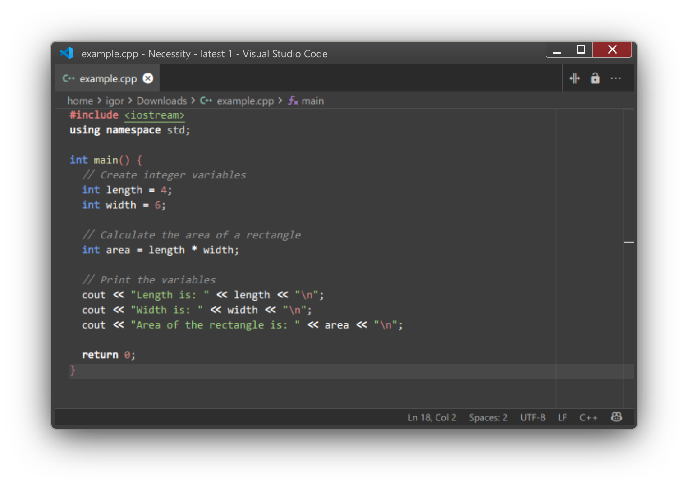
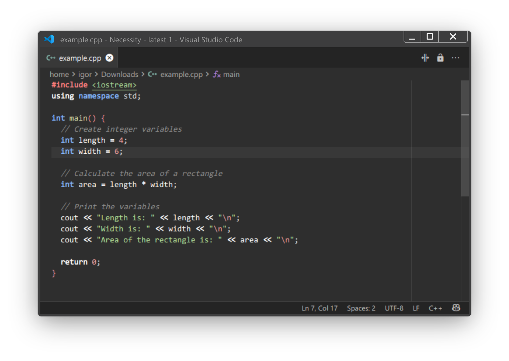
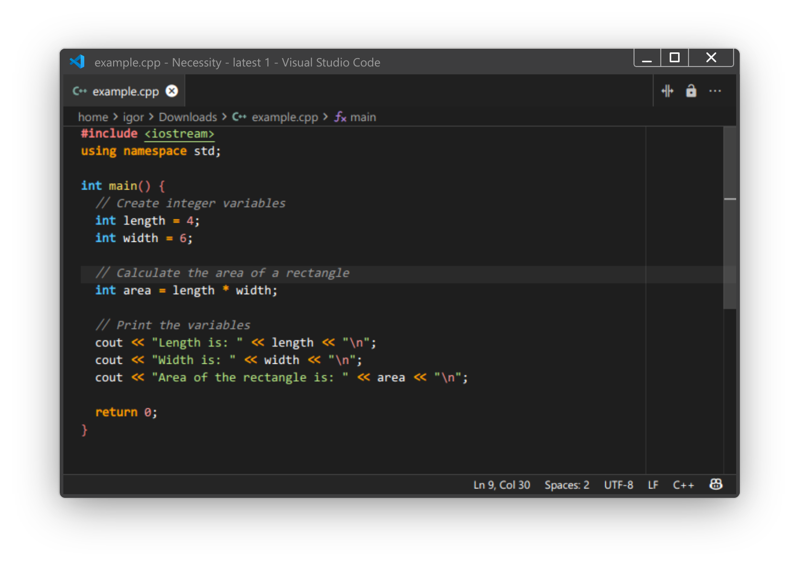
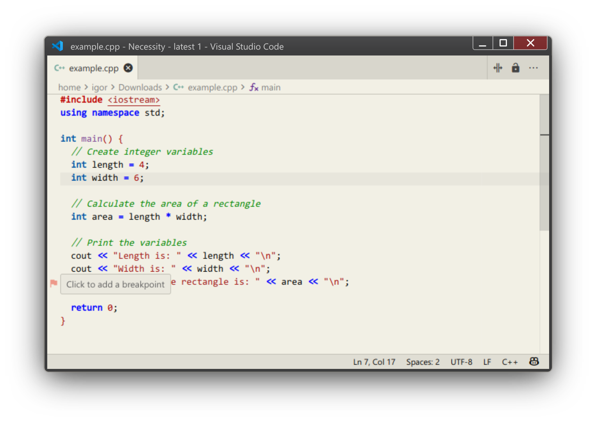

# Necessity 

Much needed color theme focused on code readability.

⬇️⬇️⬇️ Has 4 Color themes  ⬇️⬇️⬇️

- **Necessity** - *Easy on the eyes*
- **Necessity Ember**
- **Necessity AAA** *- High Contrast*
- **Necessity AAA Light**

Try with [Consolas Ligaturized](https://github.com/somq/consolas-ligaturized/) or [Fira Code](https://github.com/tonsky/FiraCode)!