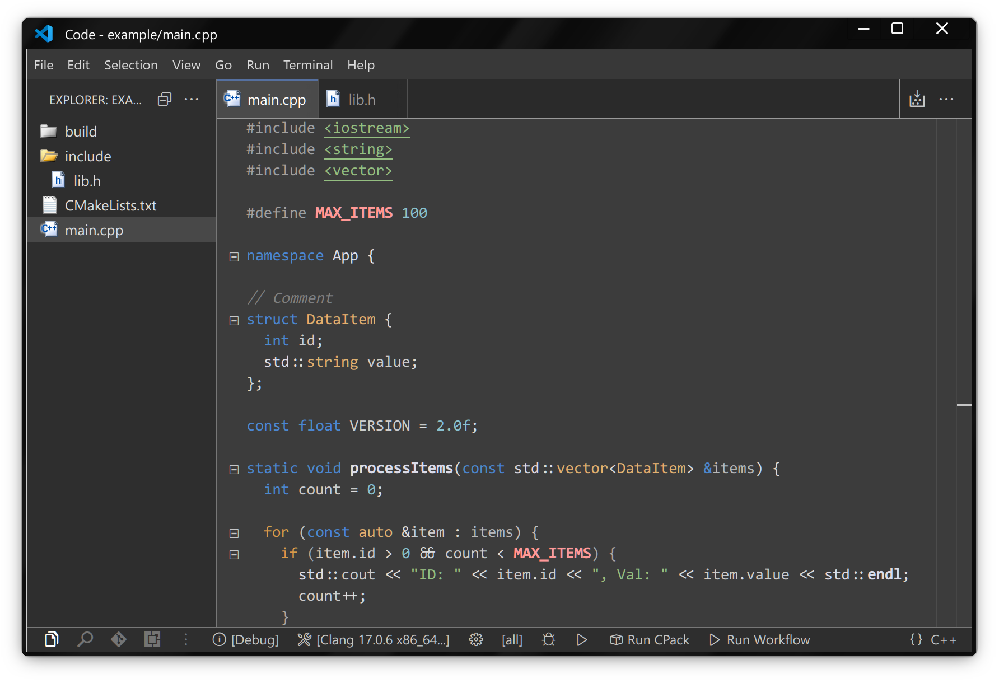

# Necessity 

Much needed color theme focused on code readability.

⬇️⬇️⬇️ Has 3 Color themes  ⬇️⬇️⬇️

- **Necessity** - *Easy on the eyes*
- **Necessity AAA** - *Enhanced contrast*
- **Necessity Light**

Try with [Consolas Ligaturized](https://github.com/somq/consolas-ligaturized/) or [Fira Code](https://github.com/tonsky/FiraCode)!

*Extensions seen in screenshots: [Activitus Bar](https://marketplace.visualstudio.com/items?itemName=Gruntfuggly.activitusbar), [theme-demo](https://marketplace.visualstudio.com/items/?itemName=xinche.theme-demo). [VS classic icons](https://marketplace.visualstudio.com/items/?itemName=jez9999.vsclassic-icon-theme)*